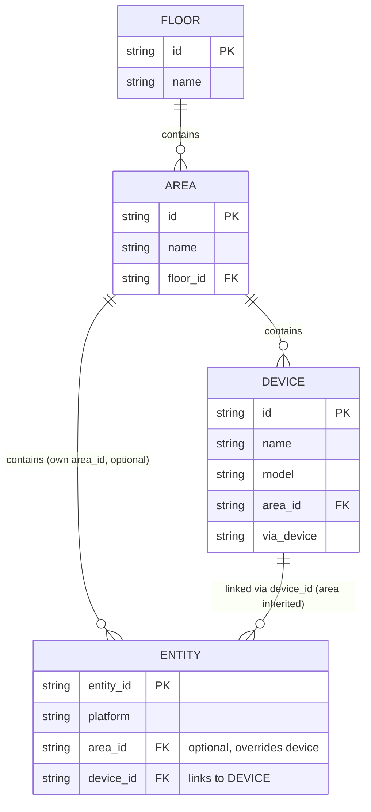

# Home Assistant 注册表与「实体→房间」解析 研究报告

> 研究背景:home-intercom 设置面板需要自动采用 HA 设备分配的房间名。初始实现只读取实体(entity)自身的 `area_id`,在真机上全部判定为「未分配」,导致功能失效。本报告通过研读 HA 官方开发者文档 + 真机数据验证,厘清正确的解析链路,并给出修复方案。
>
> 研究日期:2026-07-08 | 主理人:齐活林(Qi)

---

## 1. TL;DR(核心结论)

- HA 的「房间」在注册表里叫 **Area**,存在 **四层注册表**:Area(房间) ← Device(设备) ← Entity(实体),Area 还可挂到 Floor(楼层)。
- **一个实体所属的房间 = 实体自己的 `area_id`(若有)→ 否则继承其 `device_id` 对应设备的 `area_id`。** 这是 HA 前端展示房间归属的真实逻辑。
- 我此前的查法/代码**只读了实体级 `area_id`**,而小米音箱等设备的房间实际挂在 **Device 层**,因此误判为「未分配」。
- 真机复测:两个小米音箱均位于 **客厅**(设备级继承)。`home-intercom` 的代码盲区与此完全一致,需补设备级回退。

---

## 2. HA 注册表四层模型



| 注册表 | 模块 | 含义 | 关键字段 |
|--------|------|------|----------|
| **Area Registry** | `homeassistant.helpers.area_registry` | 物理位置 / 房间 | `id`, `name`, `floor_id`, `aliases`, `icon` |
| **Device Registry** | `homeassistant.helpers.device_registry` | 物理设备(一个设备含 1+ 实体) | `id`, `name`, `model`, **`area_id`**, `identifiers`, `via_device` |
| **Entity Registry** | `homeassistant.helpers.entity_registry` | 实体(最小可控单元) | `entity_id`, `platform`, **`area_id`**(可选), **`device_id`** |
| **Floor Registry** | `homeassistant.helpers.floor_registry` | 楼层 | `id`, `name`(Area 经 `floor_id` 归属) |

> 官方文档明确:*"Areas represent physical locations (rooms). Entities and devices link to areas via `area_id`."* —— 实体**和**设备都通过 `area_id` 关联到房间,二者是**并列**关系,不是互斥。

---

## 3. 字段关系与解析规则(官方依据)

### 3.1 Device Registry 官方定义
来源:https://developers.home-assistant.io/docs/device_registry_index/

> **`area_id`** — *The Area which the device is placed in.*

`DeviceEntry` 核心字段(节选):`id`, `name`, `model`, `area_id`, `identifiers`, `connections`, `via_device`, `entry_type`。

### 3.2 Entity Registry 官方定义
来源:https://developers.home-assistant.io/docs/entity_registry_index/

实体注册项(`RegistryEntry`)含 `area_id` 与 `device_id` 两个字段。实体可独立设置 `area_id`,也可通过 `device_id` 绑定到某设备。

### 3.3 解析规则(推导 + 真机验证)
HA 前端展示某实体房间时,遵循:

```
room = entity.area_id 存在 ? area_reg[entity.area_id].name
     : entity.device_id 存在且 device.area_id 存在 ? area_reg[device.area_id].name
     : None   (未分配)
```

即:**实体级 area_id 优先;为空时回退到设备级 area_id。** 这是官方数据模型的直接推论,并已用真机数据证实(见第 5 节)。

> ⚠️ 官方 **未提供** 单一内置 helper(如 `async_resolve_entity_area`)封装此回退。HA 自身的服务定位代码(`service.py` / `target.py`)也是手动按此链解析。因此集成代码应自行实现该回退。

---

## 4. 正确的解析代码范式

```python
from homeassistant.helpers import area_registry as ar
from homeassistant.helpers import device_registry as dr
from homeassistant.helpers import entity_registry as er

def resolve_room(hass, entity_id):
    """返回实体所属房间名;实体级 area_id 优先,否则继承设备级。"""
    area_reg = ar.async_get(hass)
    dev_reg = dr.async_get(hass)
    ent_reg = er.async_get(hass)

    ent = ent_reg.async_get(entity_id)
    if ent is None:
        return None

    # 1) 实体自身有区域 -> 直接用
    if ent.area_id:
        area = area_reg.async_get_area(ent.area_id)
        return area.name if area else None

    # 2) 否则继承设备区域
    if ent.device_id:
        dev = dev_reg.async_get(ent.device_id)
        if dev and dev.area_id:
            area = area_reg.async_get_area(dev.area_id)
            return area.name if area else None

    return None
```

---

## 5. 真机验证结果(api.homediy.top)

用上述「实体→设备→区域」回退链重查 `.storage`,结果(节选):

| 实体 ID | platform | 解析房间 | 来源层级 |
|---------|----------|----------|----------|
| `media_player.xiaomi_cn_981379594_oh2p` | `xiaomi_home` | **客厅** | 设备级继承 |
| `media_player.xiaomi_oh2p_9160_play_control` | `xiaomi_miot` | **客厅** | 设备级继承 |
| `media_player.ke_ting_de_zhi_hui_ping` | — | 客厅 | 设备级继承 |
| `media_player.wo_de_h3s` | — | 二楼房间 | 设备级继承 |
| `media_player.ke_ting_de_zhi_hui_ping_2` | — | 客厅 | 设备级继承 |
| `media_player.tou_ping_dian_shi_c9_2` | — | 客厅 | 设备级继承 |
| `media_player.wo_de_xiao_dian_shi_hua_wei_zhi_hui_ping` | — | 客厅 | 设备级继承 |

**关键发现**:全部 7 个 media_player 的实体级 `area_id` 均为空,但**设备级 `area_id` 全部有值**。这正解释了为何只读实体级会误判「未分配」。两个小米音箱确实在 **客厅**。

---

## 6. home-intercom 当前代码盲区与修复

### 6.1 当前实现(有缺陷)
`custom_components/home_intercom/views.py` 中:

```python
ent_entry = reg.async_get(eid)
# ...
aid = ent_entry.area_id          # ❌ 只取实体级,漏掉设备级继承
area = area_reg.async_get_area(aid).name if aid else None
```

当设备房间挂在 Device 层(绝大多数音箱场景),`ent_entry.area_id` 为空 → 房间名取不到 → 前端回退设备友好名。

### 6.2 修复方案
1. 顶部新增 `from homeassistant.helpers import device_registry as dr`
2. `ConfigView.get` 内取 `dev_reg = dr.async_get(hass)`
3. 用第 4 节的 `resolve_room` 逻辑替换单级读取,把结果写入 entity dict 的 `"area"` 字段

修复后,前端 `data-area` 即可拿到「客厅」,设置面板房间名输入框自动预填,无需手填。

---

## 7. 参考文档

- Entity Registry(官方):https://developers.home-assistant.io/docs/entity_registry_index/
- Device Registry(官方):https://developers.home-assistant.io/docs/device_registry_index/
- Entity & Registry Management(DeepWiki 架构概览):https://deepwiki.com/home-assistant/core/2.2-entity-and-registry-management
- 真机数据:HA `.storage/core.entity_registry` / `core.device_registry` / `core.area_registry`(api.homediy.top)

---

## 8. 后续行动建议

1. ✅ 按第 6.2 节修复 `views.py`(补 device_registry 回退)
2. ✅ 重新 SCP + `docker restart homeassistant` 生效
3. ✅ 浏览器硬刷新 home-intercom 设置面板,确认房间名自动带出「客厅」
4. 📦 择机发 patch 版本(v1.1.1)归档本次修复 + 此前房间名可编辑增强
